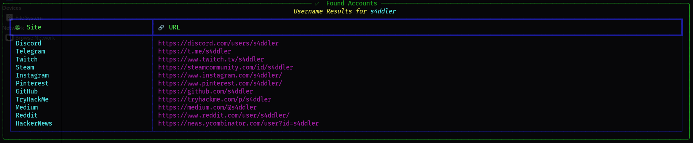
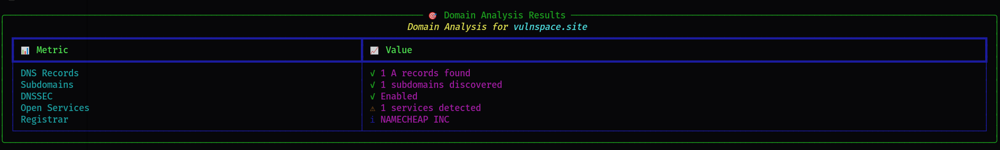

<div align="center">
  

  <p align="center">
    
    
    
    <a href="https://twitter.com/S4ddler"></a>
  </p>

  <p align="center">🔍 A powerful and beautiful OSINT command line tool for reconnaissance.</p>

<pre>
    ███████╗██╗      ██████╗ ██████╗ ██████╗  █████╗ 
    ██╔════╝██║     ██╔═══██╗██╔══██╗██╔══██╗██╔══██╗
    █████╗  ██║     ██║   ██║██████╔╝██████╔╝███████║
    ██╔══╝  ██║     ██║   ██║██╔═══╝ ██╔═══╝ ██╔══██║
    ██║     ███████╗╚██████╔╝██║     ██║     ██║  ██║
    ╚═╝     ╚══════╝ ╚═════╝ ╚═╝     ╚═╝     ╚═╝  ╚═╝
</pre>
</div>


## 📖 Overview

FLOPPA is a powerful OSINT (Open Source Intelligence) framework designed for comprehensive domain and username reconnaissance. It provides detailed insights through various modules, helping security researchers and professionals gather intelligence efficiently.

## ✨ Features

### 🌐 Domain Reconnaissance
- **DNS Analysis**
  - Comprehensive DNS record enumeration (A, AAAA, CNAME, MX, NS, TXT, SOA, CAA, DS, DNSKEY)
  - Zone transfer testing
  - DNSSEC validation
  - Reverse DNS lookups

- **Service Discovery & Port Scanning**
  - Smart port scanning with real-time results
  - Advanced service fingerprinting for common ports:
    - Web servers (HTTP/HTTPS)
    - SSH servers with version detection
    - FTP services and banner analysis
    - Database services (MySQL, PostgreSQL, MongoDB, Redis)
    - Mail servers (SMTP, POP3, IMAP)
    - Remote access services (RDP, VNC)
    - DNS services
    - Custom port ranges support
  - Intelligent banner grabbing and analysis
  - Service version detection and enumeration
  - Real-time service identification
  - TLS/SSL certificate analysis and validation
  - Concurrent scanning for faster results
  - Rate limiting and timeout controls

- **Web Technologies**
  - HTTP/HTTPS server fingerprinting
  - Web server version detection
  - Technology stack identification

- **Additional Features**
  - Subdomain enumeration via crt.sh
  - Custom wordlist support for subdomain brute-forcing
  - GeoIP location data
  - WHOIS information gathering

### 👤 Username Reconnaissance
- **Advanced Social Media Scanning**
  - Massive sites catalog in JSON format
  - Adaptive detection rules
  - Cross-platform username search
  - Social media presence detection
  - Profile information gathering
- **Performance Features**
  - Asynchronous scanning
  - Smart retries and rate-limit handling
  - Proxy support with rotation
  - User-agent rotation
  - Concurrent scanning

## 🚀 Quick Start

### Prerequisites
```bash
# Create and activate virtual environment (recommended)
python -m venv venv
source venv/bin/activate  # Linux/Mac
# or
venv\Scripts\activate     # Windows

# Install required packages
pip install -r requirements.txt
```

### Basic Usage

1. **Domain Reconnaissance**
```bash
python main.py --type domain --target example.com
```

2. **Username Search**
```bash
python main.py --type username --target username123
```

## 🛠️ Advanced Options

```bash
Options:
  --type {username,domain}  OSINT module to run
  --target TARGET          Target value (username or domain)
  --output OUT            Output directory for reports (default: out)
  --format FORMAT         Output formats: table,json,csv,md (default: table,json)
  --proxy PROXY          HTTP proxy URL (e.g. http://127.0.0.1:8080)
  --timeout TIMEOUT      Per-request timeout seconds (default: 15)
  --concurrency CONC     Concurrent tasks for username scans (default: 50)
  --retries RETRIES     Retries for transient errors (default: 2)
  
Domain-specific options:
  --wordlist FILE        Subdomain wordlist path
  --dns-server DNS      Specific DNS server for queries
  --no-axfr             Skip AXFR zone-transfer attempts

Port Scanning options:
  --top-ports PORTS     Comma-separated TCP ports to test
                        Default includes common services:
                        - Web (80,443,8080,8443)
                        - Mail (25,110,143,587)
                        - Database (3306,5432,6379,27017)
                        - Remote (22,3389,5900)
                        - And many more...
  --no-scan-ports       Disable port scanning module
  --timeout TIMEOUT     Adjust connection timeout (default: 15s)
```

## 📊 Output Formats

FLOPPA supports multiple output formats for better integration with your workflow:
- Table view (default): Clean, formatted terminal output
- JSON: Structured data for programmatic processing
- CSV: Spreadsheet-friendly format
- Markdown: Documentation-ready reports

## �️ System Requirements

- Python 3.9+
- `dig` (bind9-dnsutils) - Will fallback to dnspython if not available

## 📋 Example Output

<details>
<summary>Click to see example username scan output</summary>


</details>

<details>
<summary>Click to see example domain scan output</summary>


</details>

## �🔒 Security Notes

- Only passive techniques are implemented by default except optional lightweight port scanning
- Always ensure you have proper authorization before scanning any targets
- Use proxy options when necessary to avoid rate limiting
- Be mindful of service terms and conditions when performing username searches

Created by Ahmad Bilaidi (S4ddler).


